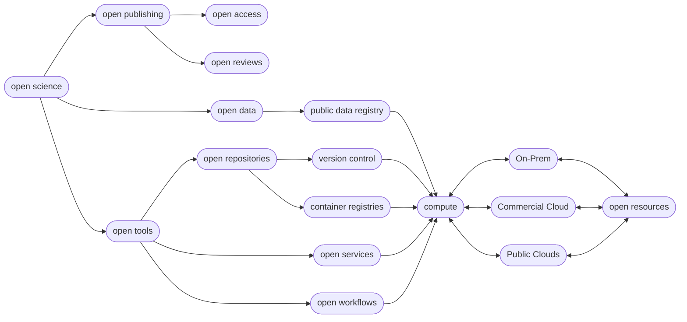

**"Open Science is the movement to make scientific research (including publications, data, physical samples, and software) and its dissemination accessible to all levels of society, amateur or professional..." [(Wikipedia)](https://en.wikipedia.org/wiki/Open_science){target=_blank}**

This Awesome List is compiled in the effort to help new researchers find and learn about Open Science Tools.

](https://github.com/sindresorhus/awesome){target=_blank} lists were started on GitHub by [Sindre Sorhus](https://sindresorhus.com/){target=_blank}. ([Searchable Index](https://awesome-indexed.mathew-davies.co.uk/){target=_blank})

## Contents

  - [Funding Opportunities](funding.md)
  - [Data Management Plans](dmp.md)
  - [Data](data.md) 
  - [Search Engines](search.md)
  - [Open Accesss Publishing](publishing.md)
  - [Open Peer Review](reviews.md)
  - [Cyberinfrastructure](cyberinfrastructure.md)
  - [Cloud](cloud.md)
  - [Hardware](hardware.md)
  - [Software](software.md)
  - [Education](edu.md) 
  - [Networks](networks.md)

### Open Science FAQ

??? Question "What is Open Science?"

    [Wikipedia definition](https://en.wikipedia.org/wiki/Open_science){target=_blank}

    [UNESCO Recommendatio non Open Science](https://unesdoc.unesco.org/ark:/48223/pf0000379949.locale=en){target=_blank}
    
     - [UNESCO Definition](https://www.unesco.org/en/natural-sciences/open-science){target=_blank}
    
    [Open Science Manifesto](https://ocsdnet.org/manifesto/open-science-manifesto/){target=_blank}

    ??? "Six Pillars :material-pillar: of Open Science"

        **:material-pillar: Open methodology**
      
        **:material-pillar: Open Source Software**
      
        **:material-pillar: Open Data**

        **:material-pillar: Open Access**

        **:material-pillar: Open Peer Review**

        **:material-pillar: Open Educational Resources**

??? Question "How do you define reproducible science?"

    ??? "Reproducibility and Replicability in Science by The National Academies 2019"

        [National Academies Report 2019](https://www.nationalacademies.org/our-work/reproducibility-and-replicability-in-science){target=_blank}

        **Reproducibility** means computational reproducibility—obtaining consistent computational results using the same input data, computational steps, methods, code, and conditions of analysis. 

        **Replicability** means obtaining consistent results across studies aimed at answering the same scientific question, each of which has obtained its own data. 

    ??? "Reproducibility vs Replicability by Plesser (2018)"

        In [Reproducibility vs. Replicability](https://doi.org/10.3389%2Ffninf.2017.00076){target=_blank}, Hans Plesser gives the following useful definitions:

        **Repeatability** (Same team, same experimental setup): The measurement can be obtained with stated precision by the same team using the same measurement procedure, the same measuring system, under the same operating conditions, in the same location on multiple trials. For computational experiments, this means that a researcher can reliably repeat her own computation.
        
        **Replicability** (Different team, same experimental setup): The measurement can be obtained with stated precision by a different team using the same measurement procedure, the same measuring system, under the same operating conditions, in the same or a different location on multiple trials. For computational experiments, this means that an independent group can obtain the same result using the author’s own artifacts.

        **Reproducibility** (Different team, different experimental setup): The measurement can be obtained with stated precision by a different team, a different measuring system, in a different location on multiple trials. For computational experiments, this means that an independent group can obtain the same result using artifacts which they develop completely independently.

        The paper goes on to further simplify:

        **Methods reproducibility**: provide sufficient detail about procedures and data so that the same procedures could be exactly repeated.

        **Results reproducibility**: obtain the same results from an independent study with procedures as closely matched to the original study as possible.

        **Inferential reproducibility**: draw the same conclusions from either an independent replication of a study or a reanalysis of the original study.

??? Question "How many pillars :material-pillar: of Open Science Are There?"

    Depending on what you find, the number generally ranges from 4 to 8

    - [Wikipedia](https://en.wikipedia.org/wiki/Open_science){target=_blank}

    - [4 :material-pillar:](https://narratives.insidehighered.com/four-pillars-of-open-science/){target=_blank}

    - [8 :material-pillar:](https://www.ucl.ac.uk/library/research-support/open-science/8-pillars-open-science){target=_blank}

    ??? Idea "Commonly Identified Pillars :material-pillar:"

          **:material-pillar: Data**
          
          FAIR Principles

          CARE Principles 

          **:material-pillar: Code**

          **:material-pillar: Publications**

          **:material-pillar: Reviews**

          **:material-pillar: Education**

??? Question "What is Cloud Native Science?"

    [Abernathey et al. (2021)](https://doi.org/10.1109/MCSE.2021.3059437){target=_blank} propose three pillars of cloud native science

    ??? "Three Pillars :material-pillar: of Cloud Native Science"
    
        **:material-pillar: Analysis-Ready Data (ARD)**

          also Analyisis Ready Cloud Optimized (ARCO) formats, e.g., [Cloud Optimized GeoTiff](https://cogeo.org){target=_blank}

        **:material-pillar: Data-proximate Computing**

          also called server-side computing, allowing computations to happen remotely

        **:material-pillar: Scalable Distributed Computing**

          the ability to modify the volume and number of resources used in a computational process.

### Diagrams

Figure: Hypothetical flow of open science tools
